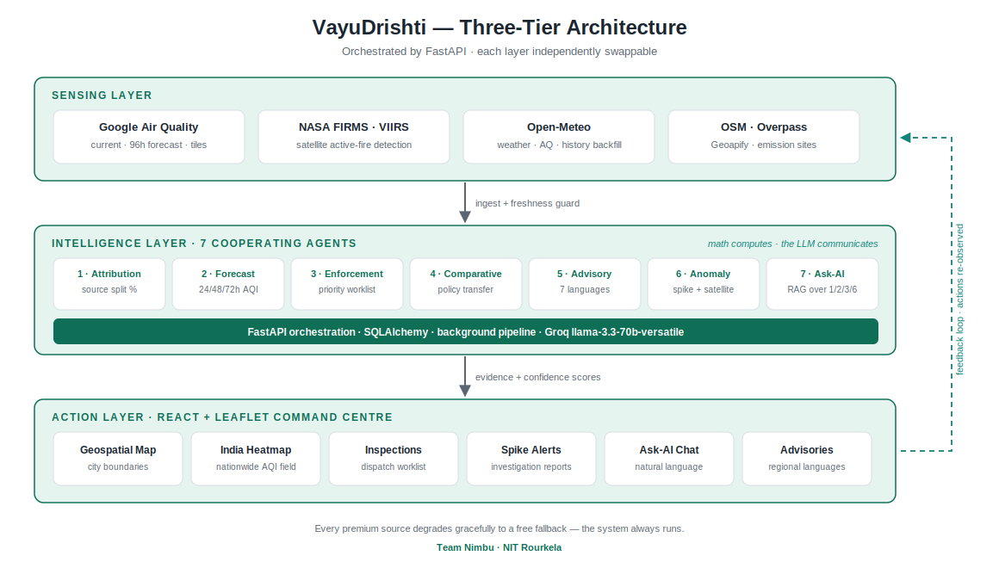

# VayuDrishti · वायु दृष्टि

**AI-Powered Urban Air Quality Intelligence for Smart-City Intervention**

> *"The data exists. The intelligence layer to act on it does not."*

VayuDrishti is that missing intelligence layer. It fuses satellite imagery, ground sensors,
meteorological forecasts and geospatial land-use data through a **multi-agent AI system** —
moving cities from **reactive monitoring** to **proactive, evidence-based intervention**.

Detect a spike → attribute it to a source → forecast the next 72 hours → dispatch an inspector
with evidence → warn citizens in their language. As one automated flow.

---

## Why it exists

India's air-quality crisis is a **national urban** emergency, not a Delhi problem:

- 24 of India's 50 most polluted cities are Tier-1/Tier-2 centres
- ~**1.67 million** premature deaths/year linked to air pollution *(Lancet Planetary Health)*
- 900+ CAAQMS monitoring stations exist, yet a 2024 CAG audit found only **31%** of monitored
  cities have any actionable multi-agency response protocol

Cities don't need another dashboard. They need **attribution**, **forecasting**, and
**enforcement intelligence** — together.

---

## Architecture



Three independently swappable layers:

| Layer | What it does |
|---|---|
| **Sensing** | Google Air Quality (India CPCB) · NASA FIRMS satellite · Open-Meteo · OSM / Overpass / Geoapify |
| **Intelligence** | 7 cooperating AI agents (FastAPI-orchestrated) |
| **Action** | React + Leaflet geospatial command centre |

**Design principle — math computes, the LLM communicates.** Every number (attribution %,
forecast AQI, z-scores, priority scores) comes from deterministic code. The LLM only formats,
translates and explains — keeping the system auditable and hallucination-resistant.

---

## The multi-agent intelligence layer

| # | Agent | What it does |
|---|---|---|
| 1 | **Source Attribution** | Splits pollution across Vehicular / Industrial / Dust-Construction / Biomass-Burning with a confidence score. Chemical fingerprinting (NO₂/PM, SO₂/NO₂, CO ratios) + wind dispersion + softmax. |
| 2 | **Hyperlocal Forecast** | 24/48/72h AQI outlook (India CPCB) from Google's 96h hourly forecast, with a physics-drift fallback. Scored against a persistence baseline. |
| 3 | **Enforcement Intelligence** | Prioritised, evidence-backed inspection worklist from real OSM industrial/construction sites (impact × feasibility + LLM justification). |
| 4 | **Multi-City Comparative** | Intervention effectiveness & policy transferability (Difference-in-Differences). *Backend module — runs standalone.* |
| 5 | **Citizen Advisory** | Ward-level health alerts auto-translated into the city's **regional language**, per channel (push / IVR / display). |
| 6 | **Anomaly Investigator** | Z-score spike detection + **NASA FIRMS** active-fire corroboration + live wind → LLM investigation report with confidence & uncertainty. |
| 7 | **Ask-AI (NL Query)** | Natural-language questions answered via RAG over the live outputs of Agents 1/2/3/6. |

**Languages supported (auto-selected by city):** Kannada · Tamil · Marathi · Bengali · Telugu · Gujarati · Hindi

---

## Tech stack

| Layer | Technologies |
|---|---|
| Backend | Python · FastAPI · SQLAlchemy · SQLite (Postgres-ready) · Alembic |
| AI / LLM | Groq `llama-3.3-70b-versatile` |
| Geospatial | Leaflet · GeoJSON · OSM / Overpass / Nominatim · Geoapify · Google heatmap tiles |
| Remote sensing | Google Air Quality API · NASA FIRMS (VIIRS) · Open-Meteo |
| Frontend | React · Vite · Recharts |

---

## Quick start

### Prerequisites
- Python 3.9+
- Node.js 18+

### 1. Backend

```bash
cd backend
python3 -m venv venv
source venv/bin/activate          # Windows: .\venv\Scripts\activate
pip install -r requirements.txt
```

Create `backend/.env`:

```env
# REQUIRED — powers all AI text (justifications, advisories, reports, Ask-AI)
GROQ_API_KEY=your_groq_key

# OPTIONAL — enables Google heatmap tiles + live current/forecast (India CPCB AQI)
GOOGLE_MAPS_API_KEY=your_google_key
GOOGLE_AQ_MAPTYPE=UAQI_INDIGO_PERSIAN

# OPTIONAL — real satellite active-fire detections in Agent 6
FIRMS_MAP_KEY=your_firms_key

# OPTIONAL — higher-quality city boundary polygons
GEOAPIFY_API_KEY=your_geoapify_key
```

Run it:

```bash
uvicorn src.api.main:app --reload
```

Backend → <http://localhost:8000> · API docs → <http://localhost:8000/docs>

### 2. Frontend

```bash
cd frontend
npm install
npm run dev
```

Frontend → <http://localhost:5173>

---

## API keys — what needs what

| Key | Required? | Without it |
|---|---|---|
| `GROQ_API_KEY` | **Yes** | AI-generated text (justifications, advisories, reports, Ask-AI) won't work |
| `GOOGLE_MAPS_API_KEY` | Optional | Falls back to Open-Meteo data + a self-built grid heatmap |
| `FIRMS_MAP_KEY` | Optional | Agent 6 still runs, reports "no active fires detected" |
| `GEOAPIFY_API_KEY` | Optional | Falls back to OSM admin boundaries |

**Everything degrades gracefully** — the app always runs, even with only the Groq key.

---

## Using the app

1. **Search any Indian city** in the top bar — boundary, live AQI and the agent pipeline load automatically.
2. The **map** is the default full-width view. Click the city polygon to open the ward panel
   (source attribution donut, 72-hour outlook, forecast skill).
3. Click **« Inspections** on the right edge to expand the side panel:
   - **Inspections** — prioritised enforcement worklist (click to fly the map to a site)
   - **Pollution Spikes** — anomaly detections with satellite-backed investigation reports
4. **India Heatmap** toggle (top-right of the map) — nationwide AQI field.
5. **Ask AI** (bottom-right) — ask questions like *"Where should I send inspectors today, and why?"*

---

## API reference

| Endpoint | Description |
|---|---|
| `POST /api/locations` | Initialise a city: boundary + telemetry, then runs the agent pipeline in the background |
| `GET /api/current_aqi` | Live AQI (India CPCB) with freshness/staleness flags. Accepts `lat`/`lon` |
| `GET /api/forecasts` | 72-hour forecast curve (Google hourly, fallback to stored) |
| `GET /api/forecast_accuracy` | Model RMSE vs. persistence baseline on backfilled history |
| `GET /api/attribution` | Source-attribution breakdown + confidence |
| `GET /api/enforcement` | Prioritised inspection worklist |
| `GET /api/anomalies` | Detected spikes + investigation reports |
| `GET /api/advisories` | Multilingual citizen advisories |
| `GET /api/boundary` | City administrative boundary (GeoJSON) |
| `GET /api/heatmap` · `/heatmap/config` · `/heatmap/tile/{z}/{x}/{y}` | Heatmap data, provider config, and the Google tile proxy |
| `POST /api/ask` | Natural-language query (Agent 7) |

---

## Heatmap refresh (cron)

When running without a Google key, the India heatmap is built from a cached grid. Refresh it
periodically:

```bash
# manual
cd backend && PYTHONPATH=. python3 src/ingestion/heatmap.py

# hourly via cron (crontab -e)
0 * * * * /path/to/VayuDrishti/backend/scripts/refresh_heatmap.sh >> /tmp/vayudrishti_heatmap.log 2>&1
```

---

## Project structure

```
VayuDrishti/
├── backend/
│   ├── src/
│   │   ├── agents/          # 7 AI agents (attribution, forecast, enforcement, …)
│   │   ├── api/             # FastAPI app + routes
│   │   ├── db/              # SQLAlchemy models & session
│   │   ├── ingestion/       # Data sources: Google AQ, FIRMS, boundaries, heatmap, telemetry
│   │   └── llm/             # LLM provider wrapper (Groq / Gemini / OpenRouter / Ollama)
│   ├── scripts/             # Cron + setup helpers
│   └── requirements.txt
├── frontend/
│   └── src/
│       ├── components/      # CityMap, WardDetailPanel, EnforcementTab, AnomalyFeed, AiChatPanel …
│       └── services/api.js  # Backend client
├── architecture.svg         # Architecture diagram
└── USER_GUIDE.md            # Detailed setup guide
```

---

## Data sources

- **[Google Air Quality API](https://developers.google.com/maps/documentation/air-quality)** — current conditions, 96h forecast, heatmap tiles (India CPCB index)
- **[NASA FIRMS](https://firms.modaps.eosdis.nasa.gov/)** — VIIRS satellite active-fire detections
- **[Open-Meteo](https://open-meteo.com/)** — free weather + air quality, history backfill
- **[OpenStreetMap](https://www.openstreetmap.org/)** / Overpass / Nominatim — emission sites & admin boundaries
- **[Geoapify Boundaries](https://www.geoapify.com/boundaries-api/)** — city outline polygons

---

<div align="center">

**VayuDrishti — from measuring pollution to acting on it, at source, in seconds.**

</div>
